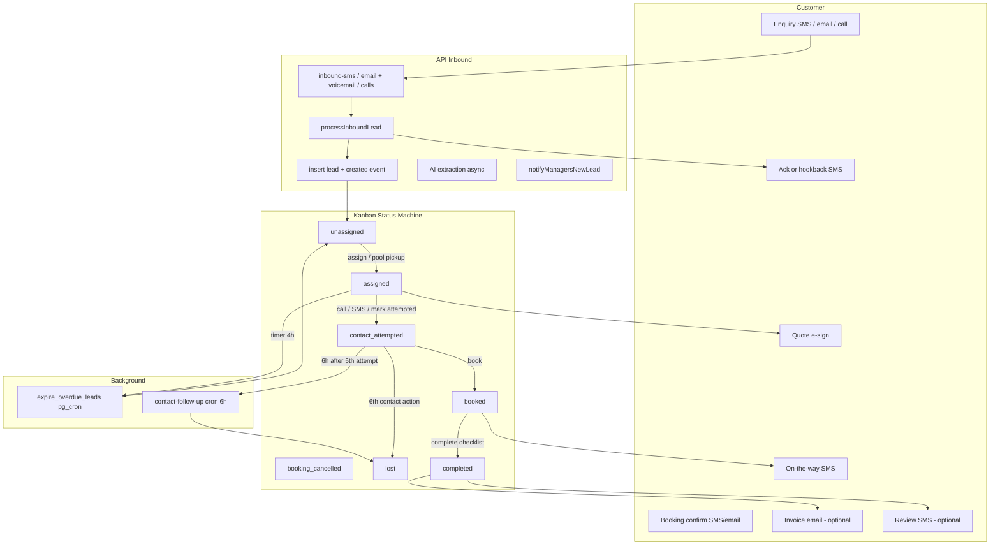
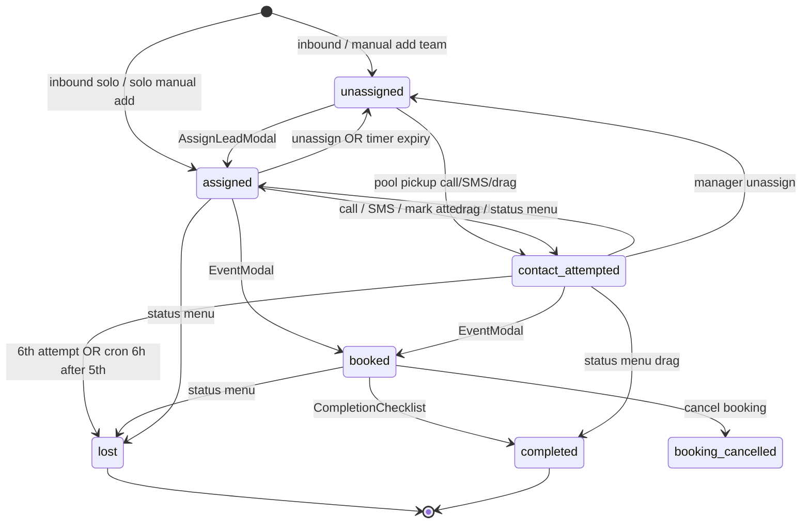
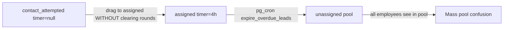
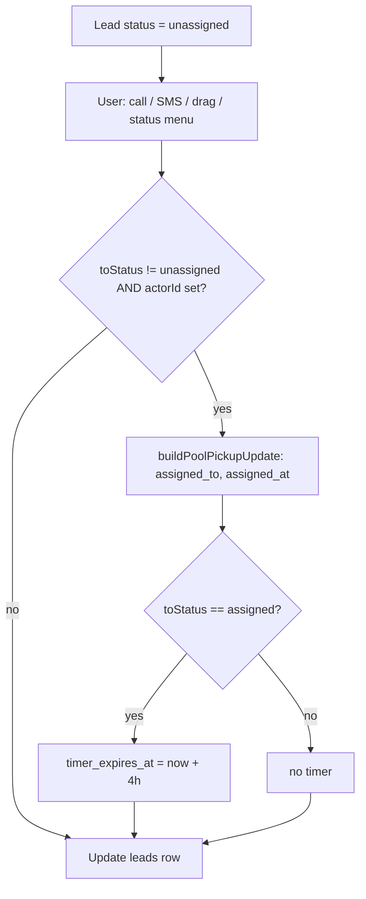
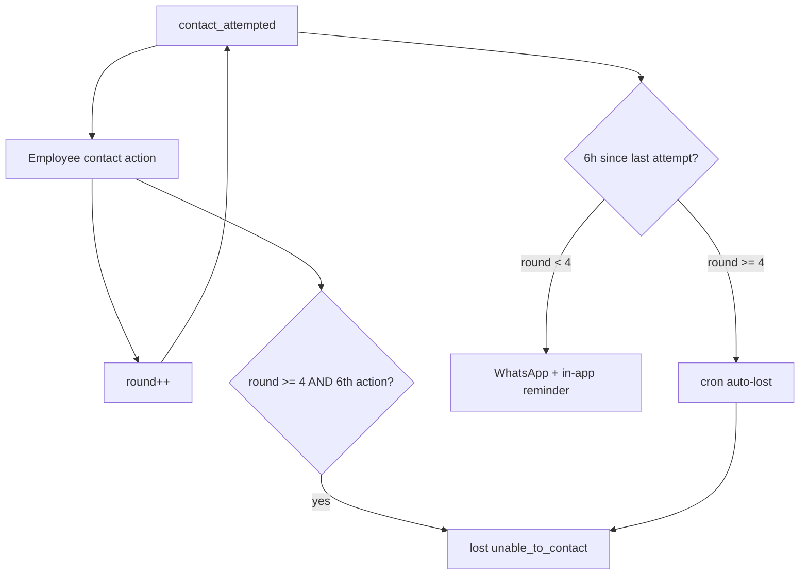
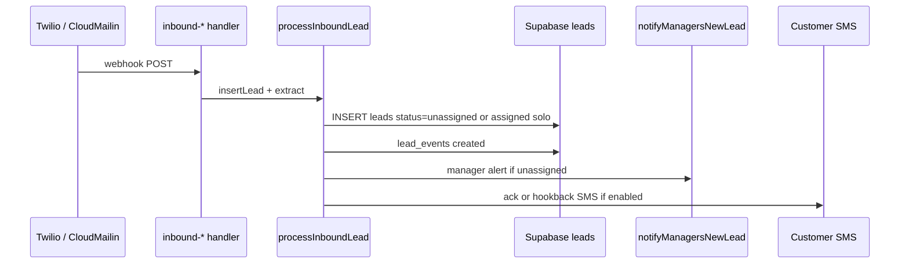

# Sales Pipeline Workflow Reference

| Field | Value |
|-------|-------|
| **Document version** | `1.6.1` |
| **Last updated** | 15-07-2026 |
| **Maintained by** | Update in the same PR as any pipeline behaviour change |

> **Living document.** This file must stay in sync with production behaviour. See [Maintenance policy](#maintenance-policy) and [Version history](#version-history).

**Related docs:** [SALES_PIPELINE_BACKLOG.md](../SALES_PIPELINE_BACKLOG.md) (automation backlog) · [PROGRESS.md](../PROGRESS.md) (implementation log)

---

## How to use this doc

Consult this reference **before** merging any change that touches:

- Lead status, assignment, timers, or contact-attempt rounds
- Kanban columns, mobile tabs, or dashboard stats
- Inbound lead creation (SMS, email, calls, voicemail, manual)
- Pipeline notifications (in-app, OneSignal, WhatsApp, customer SMS)
- Cron / background jobs affecting leads

### Change checklist (required)

Before merging a pipeline change, answer:

1. **Statuses** — Which kanban buckets and mobile tabs are affected?
2. **Timer** — Does the change set, clear, or leave `timer_expires_at`? Will pg_cron expire the lead back to the pool?
3. **Pool visibility** — Does `status=unassigned` count or employee RLS filter change?
4. **Contact rounds** — Does `contact_attempt_round` / `last_contact_attempted_at` change? Will cron auto-lost or reminders fire differently?
5. **Notifications** — Which customer or employee messages fire on this path?
6. **Doc** — Is this file updated and the document version bumped in the same PR?

---

## Maintenance policy

**Rule: any PR that changes pipeline behaviour must update this document in the same PR.**

1. Edit the affected sections (state machine, coupling matrix, diagrams, file index).
2. Bump **Document version** in the header (semver):
   - **Patch** (`1.0.x`) — wording, clarifications, typo fixes, no behaviour change
   - **Minor** (`1.x.0`) — new transition, notification, UI entry point, or feature switch behaviour
   - **Major** (`x.0.0`) — removed/replaced status, reordered lifecycle, breaking visibility rules
3. Set **Last updated** to today (`DD-MM-YYYY`).
4. Append a row to [Version history](#version-history) with version, date, and summary.
5. If adding a Cursor rule trigger file, update globs in [`.cursor/rules/sales-pipeline-changes.mdc`](../.cursor/rules/sales-pipeline-changes.mdc).

The Cursor rule `sales-pipeline-changes` enforces this for agents and reviewers.

---

## Actors and surfaces

| Actor | What they experience | Primary code |
|-------|---------------------|--------------|
| **Customer** | Ack SMS, hookback SMS, on-the-way SMS, quote e-sign, invoice email, review SMS | `api/_lib/leadAckSms.ts`, `api/_lib/missedCallHookbackSms.ts`, `src/pages/QuoteAcceptPage.tsx`, `src/lib/reviewRequest.ts` |
| **Employee** | Pool + own leads on `/leads`, call/SMS/book/complete from card or sheet | `src/pages/LeadsPage.tsx`, `src/components/LeadDetailSheet.tsx` |
| **Manager** | Full org kanban, assign modal, reports, `/activity` workload | `src/components/AssignLeadModal.tsx`, `src/pages/ManagerDashboard.tsx` |
| **Solo operator** | Inbox / In progress / Done (no unassigned column); inbound auto-assigned | `src/lib/leadsKanban.ts`, `src/lib/soloLeadAssignment.ts`, `api/_lib/soloInboundLead.ts` |
| **System** | Inbound webhooks, contact-follow-up cron, assign-timer expiry (pg_cron) | `api/_lib/processInboundLead.ts`, `api/_lib/runContactFollowUpCron.ts` |

---

## Full lifecycle

### Stage summary (capture → review)

| Stage | Customer | User (app) | API / system |
|-------|----------|------------|--------------|
| **1 Capture** | Sends enquiry | Lead appears in Unassigned (team) or Inbox (solo) | `inbound-*` → `processInboundLead` → `leads` insert |
| **2 Extraction** | — | Structured fields populate on card; managers see extraction status + retry | Claude extraction via `extractLead.ts`; `extraction_status` on `leads` |
| **3 Acknowledgment** | Receives ack / hookback SMS | Manager bell (+ WhatsApp if enabled) | `leadAckSms`, `missedCallHookbackSms`, `notifyManagersNewLead` |
| **4 Quoting** | SMS link + e-sign / decline on `/quote/:token`; sees real GST component when org is GST-registered; sees itemised line items when the quote used the price list | Manager sends quote (SMS preferred), optionally via price-list quick-add chips; Book CTA after accept | `QuoteComposerModal` → `quotes` (`gst_amount` via `shared/gst.ts`, `line_items` via `price_list` feature); accept notifies managers |
| **5 Booking** | Booking confirm SMS + email/.ics (if `booking_confirm` enabled) | Book via `EventModal` → calendar | `booking-confirm` action gated by `booking_confirm` feature switch (default ON); lead → `booked` |
| **6 Execution** | On-the-way SMS optional | Complete via `CompletionChecklist` only (no drag bypass) | Lead → `completed`; photos optional (offline queue supported) |
| **7 Invoicing** | Invoice email if sent — titled "Tax Invoice" with org ABN + GST line when the org is GST-registered, else plain "Invoice"; itemised line items when the accepted quote or invoice used the price list | Send/skip in completion flow; price-list quick-add chips carry the accepted quote's line items forward automatically | `one_tap_invoice` feature; `invoices.gst_amount` via `shared/gst.ts`; `price_list` feature for chips (multi-line editing always available) |
| **8 Payment** | "Pay Now" button in invoice email/chase (if `invoice_card_payments` enabled + org connected Stripe) → Stripe Checkout on the org's own connected account; BSB/PayID instructions always shown as fallback | Manager can still mark paid manually at any time | `POST/GET /api/stripe?action=invoice-pay` (public, token-based, redirects to Stripe) |
| **9 Reconciliation** | Redirected to `/invoice/:token` status page after paying | Invoice flips to `paid`/`paid_via='stripe'` automatically; manual mark-paid still available for cash/bank | Stripe Connect webhook (`action=connect-webhook`) → idempotent `markInvoicePaid(id, orgId, 'stripe', ...)` |
| **10 Review** | Review SMS if sent | Send/skip in completion | `review_requests` on complete, not on paid |

---

## Kanban status machine

### Columns and labels

**Team mode** (`src/lib/leadsKanban.ts`):

| DB status | Column label | Mobile tab |
|-----------|--------------|------------|
| `unassigned` | Unassigned | Unassigned |
| `assigned` | Assigned | Assigned |
| `contact_attempted` | Contact Attempted | Contacted (grouped) |
| `booked` | Booked | Contacted |
| `booking_cancelled` | Booking Cancelled | Contacted |
| `lost` | Lost | Done / Lost |
| `completed` | Completed | Done / Lost |
| `expired` | Expired (server-driven; not a column) | — |

**Solo mode** — same statuses, relabelled: Inbox (`assigned`), In progress (`contact_attempted`), Done (`completed`). **No Unassigned column.**

### Transition table

| From | To | UI / system trigger | DB fields changed | Side effects |
|------|-----|---------------------|-------------------|--------------|
| — | `unassigned` | Inbound webhook, manual add (team), manager unassign, **timer expiry** | Clears `assigned_to`, `timer_expires_at`, contact rounds | Manager alert on create; pool count increases |
| — | `assigned` | Solo inbound, solo manual add | `assigned_to`, `timer_expires_at` (24h solo) | Solo owner owns lead immediately |
| `unassigned` | `assigned` | `AssignLeadModal` | `assigned_to`, `assigned_at`, `timer_expires_at` (4h), resets contact fields | In-app notify + `tech_assignment` WhatsApp |
| `unassigned` | `contact_attempted` | Call, SMS, drag, status menu (pool pickup) | `assigned_to`=actor, round=0, **no timer** | `call_attempted` / `sms_attempted` event |
| `assigned` | `contact_attempted` | Call, SMS, mark attempted, drag, menu | Clears `timer_expires_at`; sets round/timestamp | Stops assign timer — lead will not auto-expire while here |
| `contact_attempted` | `assigned` | Drag, status menu | Status only (rounds **not** reset) | See regression example below |
| `assigned` | `unassigned` | pg_cron `expire_overdue_leads` | Full pool reset | `expired` event (`actor_id` = previous assignee); lead re-enters pool for **all** employees |
| `contact_attempted` | `lost` | 6th contact action; cron after 6h on 5th attempt | `lost_reason=unable_to_contact` | Confirm dialog (UI) or cron (server) |
| any | `unassigned` | Manager unassign / drag to Unassigned | Clears assignee, timer, rounds | `unassigned` event |
| any | `booked` | `EventModal` | Status `booked`; may set assignee | Calendar `events` row; booking WhatsApp |
| any | `completed` | `CompletionChecklist` only (drag/menu open checklist) | Status `completed` | Optional invoice + review modals |
| `booked` | `booking_cancelled` | Cancel booking flow | Status change | `booking_cancelled` event |

### Documented regression: contact attempted → assigned → unassigned

**What happened:** A change routed contact follow-up back into `assigned` without accounting for the assign timer.

**Why it broke:**

1. `assigned` status can carry `timer_expires_at` (4h team / 24h solo) when set by `AssignLeadModal` or `buildPoolPickupUpdate` when `toStatus === 'assigned'`.
2. `contact_attempted` clears the timer (`buildContactAttemptUpdate` sets `timer_expires_at: null`).
3. Moving `contact_attempted` → `assigned` via drag/menu **does not** reset contact rounds and **does not** automatically set a timer — but if a subsequent change re-introduces a timer or the lead never left `assigned` with an active timer, pg_cron `expire_overdue_leads()` flips `assigned` → `unassigned`.
4. Pool badge (`useLeadsPoolCount`) counts `status=unassigned` only — expired leads flood the pool and appear to every employee (`fetchLeads` RLS: `status=unassigned OR assigned_to=me`).

**Before changing contact/assign flows, verify:**

- Is `timer_expires_at` set, cleared, or inherited?
- Should this lead ever return to the unassigned pool?
- Will employees see it in the pool while still believing they own it?

---

## Field coupling matrix

| Field | Set when | Cleared when | If wrong |
|-------|----------|--------------|----------|
| `status` | Every transition | — | Wrong column, dashboard stat, mobile tab |
| `assigned_to` | Assign, pool pickup | Unassign, → `unassigned` | Employee RLS hides/shows lead |
| `assigned_at` | Assign, pool pickup | Unassign | Reporting attribution |
| `timer_expires_at` | → `assigned` (4h team; 24h solo inbound) | Contact attempted, unassign | pg_cron → `unassigned` |
| `contact_attempt_round` | Contact actions (0–4 labelled 1st–5th) | Unassign, `AssignLeadModal` | Wrong attempt badge; premature auto-lost |
| `last_contact_attempted_at` | Contact actions | Unassign | Cron reminder / auto-lost timing |
| `lost_reason` | Auto-lost `unable_to_contact` | Unassign | "Unable to contact" label on card |
| `hidden_from_kanban_at` | Monthly reporting job | — | Lead hidden while still `lost`/`completed` |

---

## Pool pickup

When a user moves a lead **out of** `unassigned`, the lead auto-assigns to the actor.

**Sources:** `call_auto_assign`, `sms_auto_assign`, `manual_contact`, `drag`, `status_menu` (`src/lib/leadPoolPickup.ts`).

---

## Contact attempt escalation

Logic: `shared/contactFollowUp.ts` (client + cron).

| Action | Round after | UI label |
|--------|-------------|----------|
| First contact from `assigned` | 0 | — |
| Second contact | 1 | 2nd Attempt |
| Third | 2 | 3rd Attempt |
| Fourth | 3 | 4th Attempt |
| Fifth | 4 | 5th Attempt |
| Sixth while on 5th | — | → `lost` (`unable_to_contact`) |

**Cron** (`/api/cron/contact-follow-up` → `runContactFollowUpCron.ts`):

- Every 6h after `last_contact_attempted_at`
- Round &lt; 4: reminder notification only (no status change)
- Round ≥ 4 (5th Attempt showing): auto-`lost` if still no success

---

## Customer experience map

| Touchpoint | Trigger | Template / feature | Default on? |
|------------|---------|-------------------|-------------|
| Lead ack SMS | Inbound SMS/email | `lead_ack_sms` | Off |
| Missed-call hookback | Inbound call/voicemail | `missed_call_hookback_sms` | Off |
| On-the-way SMS | Employee taps SMS on card | `customer_ontheway_sms` | Off |
| Quote e-sign | Manager sends quote | `quote_esign` | Off |
| Booking confirm SMS + email/.ics | Book via `EventModal` | `booking_confirm` | **On** |
| Invoice email | Completion checklist | `one_tap_invoice` | Off (FieldBourne may override) |
| Review SMS | Completion checklist | `review_requests` | Off |

Quote accept notifies managers (in-app + OneSignal) and sets `latest_quote_status=accepted` so the lead card/sheet shows **Book Job**. Customer decline is supported on the public page. Completions only via `CompletionChecklist` (drag/menu to `completed` opens checklist, does not set status alone).

Offline (PWA): call/SMS contact attempts and lead photos can enqueue to IndexedDB (`src/lib/offlineQueue.ts`) and flush when back online. Book/assign/complete are online-only.

---

## User experience map

### Manager

1. **Dashboard** (`ManagerDashboard`) — stats link to `/leads?status=unassigned|assigned|contact_attempted|completed`
2. **Assign** — `AssignLeadModal`: proximity ranking, 4h timer, WhatsApp to tech
3. **Monitor** — `TeamWorkloadPanel`, `/activity` live feed
4. **Unassign** — `LeadDetailSheet` → back to pool (clears all assign/contact fields)

### Employee

1. **Pool** — sees `unassigned` + own leads; mobile nav badge = pool count
2. **Pickup** — call/SMS from pool auto-assigns + `contact_attempted`
3. **Work** — Assigned countdown timer; Contact Attempted follow-up badge
4. **Close** — Book → Complete checklist

**RLS query** (`LeadsPage.fetchLeads`): `status=unassigned OR assigned_to=current_user`

### Solo operator

- No unassigned column; manual leads start `assigned` to owner (`soloLeadAssignment.ts`)
- Inbound solo leads: `api/_lib/soloInboundLead.ts` (24h timer)
- Mobile tabs: Inbox / Active / Done

---

## API experience map

### Inbound sequence

| Endpoint | File | Creates lead |
|----------|------|--------------|
| `POST /api/inbound-sms` | `api/inbound-sms.ts` | Yes |
| `POST /api/inbound-email` | `api/inbound-email.ts` | Yes (email + CloudMailin voicemail) |
| Manual / paste | `AddLeadModal`, `EmailParser` | Client insert |

**Important:** Status mutations after creation are **client-side Supabase updates** — no server-side transition validation; RLS is the guard.

### Cron and background

| Job | Route / trigger | Effect |
|-----|-----------------|--------|
| Contact follow-up | `GET/POST /api/cron/contact-follow-up` | Reminder or auto-`lost` on stale `contact_attempted` |
| Assign timer expiry | pg_cron `expire_overdue_leads()` | `assigned` → `unassigned`; inserts `expired` audit event attributed to previous assignee |
| Monthly reporting | pg_cron snapshots | Read-only; may set `hidden_from_kanban_at` |

### Status change entry points (client)

| UI action | Handler | Shared helpers |
|-----------|---------|----------------|
| Drag column | `LeadsPage.handleDragEnd` | `buildContactAttemptUpdate`, `buildPoolPickupUpdate` |
| Status menu | `LeadStatusMenu.applyStatusUpdate` | same |
| Call | `LeadsPage.handleCall` | pool pickup + contact attempt |
| SMS | `LeadsPage.handleSMS` | pool pickup + contact attempt |
| Mark attempted | `LeadsPage.handleMarkContactAttempted` | contact attempt |
| Assign | `AssignLeadModal.handleAssign` | timer + notify |
| Unassign | `LeadsPage.handleUnassign` | pool reset |
| Book | `EventModal` | `booked` + `events` |
| Complete | `CompletionChecklist` / `confirmComplete` | `completed` |

---

## Notification matrix

| Event | In-app | OneSignal | WhatsApp template | Customer SMS |
|-------|--------|-----------|-------------------|--------------|
| New unassigned lead | Managers (`new_lead`) | Partial | `manager_alert` | `lead_ack_sms` |
| Lead assigned | Assignee (`lead_assigned`) | Yes | `tech_assignment` | — |
| Contact follow-up 6h | Assignee (`contact_follow_up`) | — | `contact_follow_up` | — |
| Booking scheduled | Assignee | Yes | `booking_scheduled` | Not automated |
| Job completed/lost | Assignee | Yes | `generic_notify` | — |
| Review request | — | — | — | `review_request` |

Templates: `api/_lib/employeeWhatsAppTemplates.ts`. Employee alerts try WhatsApp first, SMS fallback (`sendEmployeeAlert.ts`).

---

## Visibility and counting

| UI element | Query / rule | File |
|------------|--------------|------|
| Pool nav badge | `COUNT(*) WHERE status='unassigned'` | `src/hooks/useLeadsPoolCount.ts` |
| Employee kanban | `status=unassigned OR assigned_to=me` | `src/pages/LeadsPage.tsx` |
| Manager dashboard stats | Group by `status` | `src/pages/ManagerDashboard.tsx` |
| Team workload | Per-tech counts Assigned / Contact / Booked | `src/hooks/useTeamWorkload.ts` |
| Hide closed from kanban | `hidden_from_kanban_at` set for old `lost`/`completed` | `src/lib/leadsKanban.ts` |

Realtime: `postgres_changes` on `leads` refreshes UI when cron expires timers or another user moves a card.

---

## Lead event types

Logged to `lead_events` for audit and reporting (`api/_lib/leadEventTypes.ts`):

`created`, `duplicate_blocked`, `missed_call_again`, `assigned`, `status_change`, `contact_attempted`, `contact_note`, `call_attempted`, `sms_attempted`, `second_attempt_started` … `sixth_attempt_started`, `booked`, `booking_cancelled`, `completed`, `lost`, `expired`, `unassigned`, `review_request`, `sms_sent`, `invoice_sent`, `invoice_paid_manual`

---

## Known gaps (impact analysis)

| Gap | Risk when changing pipeline |
|-----|----------------------------|
| No server-side transition validation | Any client change can write invalid states |
| Feature switches default off | Stages 3–10 may be inactive until enabled per org |
| Quote accept → booking not chained | Status may not reflect quote acceptance |
| Review on complete, not paid | Payment changes do not affect review |
| Vercel cron schedule for contact-follow-up | May be dashboard-only (rewrite exists in `vercel.json`) |

---

## File index

### Client UI
- `src/pages/LeadsPage.tsx` — main kanban, drag, call/SMS, fetch
- `src/components/LeadCard.tsx`, `LeadDetailSheet.tsx`, `LeadStatusMenu.tsx`
- `src/components/AssignLeadModal.tsx`, `EventModal.tsx`, `CompletionChecklist.tsx`
- `src/components/AddLeadModal.tsx`, `EmailParser.tsx`, `QuoteComposerModal.tsx`
- `src/pages/ManagerDashboard.tsx`, `EmployeeDashboard.tsx`, `TeamActivityPage.tsx`

### Shared logic
- `shared/contactFollowUp.ts` — contact rounds, cron logic, kanban sort
- `shared/expireOverdueLeads.ts` — assign-timer expiry patch + audit event shape
- `src/lib/leadPoolPickup.ts` — pool auto-assign
- `src/lib/leadsKanban.ts` — columns, tabs, labels
- `src/lib/timer.ts` — 4h production timer
- `src/lib/leadEvents.ts` — audit logging
- `src/lib/soloLeadAssignment.ts` — solo manual create

### API
- `api/_lib/processInboundLead.ts` — inbound pipeline
- `api/_lib/extractLead.ts` — Claude extraction + SMS/email fallbacks
- `api/_lib/retryLeadExtraction.ts` — manager retry + voicemail enrich
- `api/leads.ts` — `action=retry-extraction` (manager/platform_admin)
- `api/inbound-sms.ts`, `inbound-email.ts` (email + CloudMailin voicemail)
- `api/_lib/runContactFollowUpCron.ts` — 6h follow-up
- `api/_lib/notifyManagersNewLead.ts`, `leadAckSms.ts`, `missedCallHookbackSms.ts`
- `api/_lib/employeeWhatsAppTemplates.ts`
- `api/send-sms.ts` — customer + employee messaging hub
- `api/stripe.ts` — SaaS billing (checkout/portal/webhook) + Connect (connect-onboard/invoice-pay/connect-webhook), single Hobby-plan function
- `api/_lib/invoiceStripe.ts` — pure payability/idempotency logic + Checkout Session builder for card payments

### Tests (behaviour contracts)
- `tests/contactFollowUp.test.ts`, `tests/contactFollowUpCron.test.ts`
- `tests/leadPoolPickup.test.ts`, `tests/processInboundLead.test.ts`

### Platform operator trace (`/platform` → Workflow Runs)
- **Row 1:** `workflow_runs` / `workflow_run_steps` for the `inbound_lead` pipeline (save lead → ack SMS).
- **Row 2:** Kanban lifecycle synthesized at read time from `lead_events` + current `leads.status` for the linked `trigger_summary.lead_id` — actual path only (deduped status transitions), not a full template.
- Bridge: dashed edge from **Ack / hookback SMS** to the first kanban node.
- Does **not** change pipeline behaviour or add new `lead_events` on assign/book; read-only for `platform_admin` (RLS SELECT on `leads` + `lead_events`).

---

## Version history

| Version | Date | Summary |
|---------|------|---------|
| `1.6.1` | 15-07-2026 | Fix: `invoice_card_payments` switch was UI-only — `handleConnectOnboard` and the public invoice-get endpoint (`action=invoice-public-get`) had no server-side gate, so a disabled org's public invoice page and Connect endpoint were still reachable directly. Both now check `isFeatureEnabledForOrg(...,'invoice_card_payments')` and return 403 when off, mirroring the existing `quote_esign` pattern on `handleQuotePublicGet`. |
| `1.6.0` | 15-07-2026 | Card / Pay Now on invoice: stages 8–9 (Payment/Reconciliation) go from "manual only" to real. Stripe Connect Standard, direct charges — each org connects/owns its own Stripe account (`StripeConnectPanel` in Settings, `action=connect-onboard`). Invoice emails and overdue-chase messages get a Pay Now button (`action=invoice-pay`, lazy Checkout Session on the connected account) when `invoice_card_payments` is enabled and the org is connected. A separate Connect webhook (`STRIPE_CONNECT_WEBHOOK_SECRET`, `action=connect-webhook`) idempotently marks the invoice paid (`paid_via='stripe'`). New public `/invoice/:token` status page. New `invoice_card_payments` feature switch (pro tier, off by default). BSB/PayID instructions remain as the always-shown fallback. |
| `1.5.0` | 15-07-2026 | Booking confirmation was previously unconditional (no way to turn off). Added `booking_confirm` feature switch, catalog default **ON** so existing behaviour is unchanged, gating `handleBookingConfirm` in `api/send-sms.ts`. Closes a gap against the "every automated customer-facing feature needs a toggle" policy. |
| `1.4.0` | 15-07-2026 | Price list / favourites: new `price_list_items` table + `quotes.line_items`; quick-add chips and an editable line-item list in `QuoteComposerModal`/`InvoiceStep` (`src/components/LineItemsEditor.tsx`); accepted quote's line items carry through to the invoice automatically; itemised breakdown on the public quote accept page. New `price_list` feature switch (basic tier) gates the chips only — manual multi-line editing is always available. |
| `1.3.0` | 15-07-2026 | GST-aware quotes/invoices: real GST component (`shared/gst.ts`, divide-by-11) on quote accept page and invoice emails; `orgs.abn` + `orgs.gst_registered` in Franchise Settings; invoices titled "Tax Invoice" with ABN when GST-registered. No new feature switch — compliance behaviour, always on. |
| `1.2.0` | 15-07-2026 | Point 1 UX: next-action CTAs, quote SMS + brand accept/decline, booking confirm SMS/.ics, checklist-only complete, offline contact/photo queue, mobile nav density |
| `1.1.0` | 13-07-2026 | Stage 2 Extraction: `extraction_status` on leads, SMS/email fallbacks, voicemail enrich on repeat call, manager retry in lead detail |
| `1.0.3` | 07-07-2026 | Retired dead Mailgun `POST /api/inbound-voicemail`; voicemail only via CloudMailin branch in `inbound-email.ts` |
| `1.0.2` | 07-07-2026 | Document platform Workflow Runs kanban row (lead_events-derived actual path, bridge from inbound ack SMS); no pipeline behaviour change |
| `1.0.1` | 03-07-2026 | Added `expire_overdue_leads()` migration: pg_cron every minute, full pool reset, `expired` audit events attributed to previous assignee; Reports leaderboard Expired column |
| `1.0.0` | 03-07-2026 | Initial workflow reference: full lifecycle, status machine, field coupling, pool pickup, contact escalation, customer/user/API maps, notification matrix, maintenance policy |
